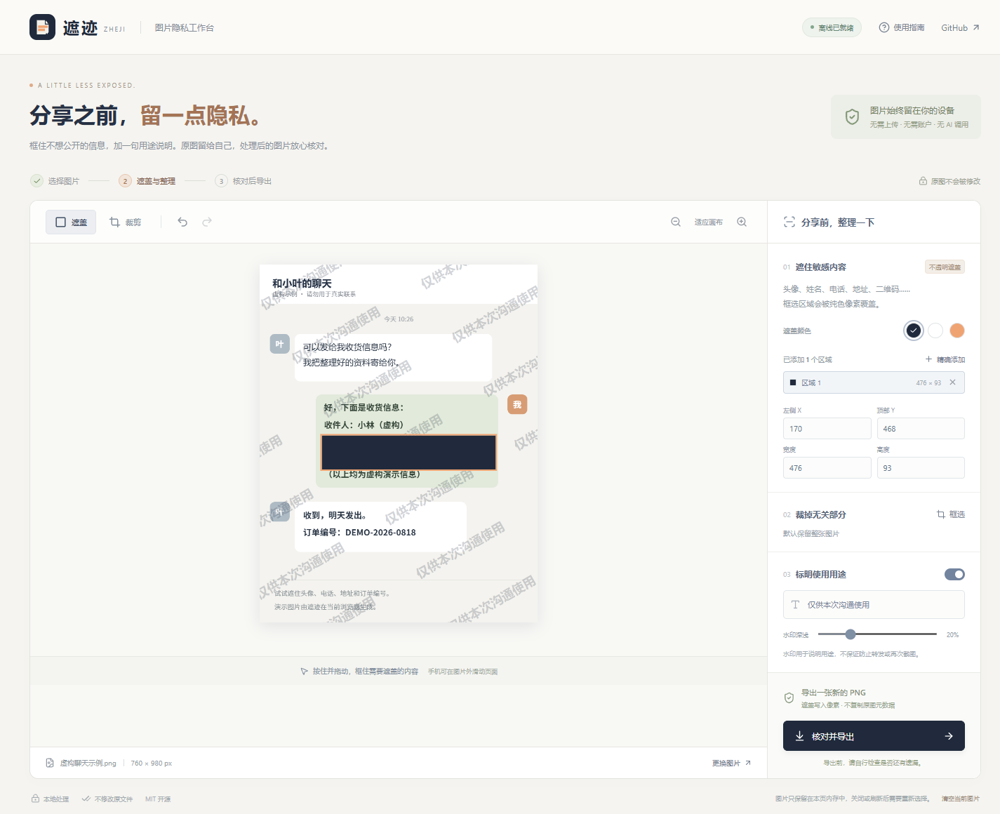

# 遮迹 Zheji

**分享之前，留一点隐私。**

在本机为聊天、订单、物流和报错截图遮盖敏感区域，按需裁剪、添加用途水印，再导出新的 PNG。无需上传、注册或 AI API。

[在线使用](https://fuzzylogic112.github.io/zheji/) · [调研依据](docs/RESEARCH.md) · [验证记录](docs/QA.md)



## 解决什么问题

分享一张截图时，通常只想说明其中一件事，却可能一起公开电话、地址、头像、订单号或拍摄元数据。遮迹把“选图 → 手动遮盖与整理 → 检查最终文件”做成一个短流程。

已有成熟的元数据清理和图片脱敏产品。本项目参考 [ExifCleaner](https://github.com/szTheory/exifcleaner) 与 [AutoRedact](https://github.com/karant-dev/AutoRedact) 的功能边界，代码独立实现，没有复制这两个项目的代码。我们选择中文界面、手动精确选区、无服务端、无 OCR 模型下载。实际持续使用价值仍待用户试用验证。

## 功能

- **选择、拖入或粘贴图片**：支持静态 PNG、普通/渐进 JPEG，每次一张。
- **不透明矩形遮盖**：遮盖写入像素；支持反向拖动、选区坐标微调、多区域、撤销/重做。
- **裁剪**：框选保留区域，导出时去掉其他部分。
- **用途水印**：重复斜向水印，自定义文字与深浅；水印不保证防复制或防转发。
- **预览最终文件**：下载前直接展示待导出的 PNG，而非另一份近似预览。
- **重新编码输出**：白色背景、原尺寸像素（或裁剪尺寸），不携带原文件名；仅保留 PNG 像素解码必要区块，不复制原图 EXIF、文本或其他非必要元数据。
- **本地和离线处理**：正式版首次加载并显示“离线已就绪”后，可断网重新打开。

原始图片文件不会被修改。图片和编辑历史仅存在当前页面内存中，不写入 IndexedDB 或 localStorage，刷新/关闭后不保留。应用缓存只有网页代码、样式和图标。

## 快速使用

1. 打开在线版，选择图片或先体验虚构示例。
2. 拖出矩形遮盖区域；也可点“精确添加”，输入原图像素坐标。选择区域后按 Delete 删除。
3. 按需裁剪或启用用途水印。
4. 点击“核对并导出”，检查最终预览，再下载 PNG。
5. 打开下载文件再核对一次，只分享这张新图片。

`Ctrl/⌘ + Z` 撤销，`Ctrl/⌘ + Shift + Z` 重做。手机画布内拖动用于框选，在图片外可以滚动页面。

**工具不会自动发现漏选信息。** 未遮盖的文字、反射、二维码、位置线索及其他可见内容仍可能识别出个人。纯色遮盖只覆盖用户实际选中的区域，不代表整张图经过匿名化认证。输出仅清除非像素元数据，不检测像素内隐写内容。

## 本地开发

推荐 Node.js 22.12+，也支持 20.19+。

```sh
git clone https://github.com/FuzzyLogic112/zheji.git
cd zheji
npm ci
npm run dev
```

```sh
npm run check     # 图像核心测试、TypeScript 检查和静态构建
npm run preview   # 启动正式版，检查离线缓存
```

请使用 `localhost` 或 HTTPS，不要直接双击 `dist/index.html`。开发模式不启用 Service Worker。

## 输入与输出边界

| 项目     | 当前实现                                                         |
| -------- | ---------------------------------------------------------------- |
| 输入格式 | 静态 PNG；8 位普通/渐进 JPEG。按实际字节检查，不只信任扩展名     |
| 大小     | 原文件 ≤20 MiB，总像素 ≤20,000,000，单边 ≤12,000 像素            |
| 暂不支持 | GIF、APNG、SVG、WebP、HEIC、PDF、多图批处理                      |
| 图片方向 | 使用浏览器 EXIF 朝向解码，选区对应解码后的图片坐标               |
| 输出     | 不透明 PNG，透明处转白底；PNG 可能明显大于原 JPEG                |
| 颜色     | 转换到浏览器画布色彩；清除颜色配置元数据可能改变专业色彩管理外观 |
| 存储     | 仅本页内存；不提供编辑项目保存、同步或账户恢复                   |
| 平台     | Chromium 实测；其他浏览器与移动真机需要进一步验证                |

图片预检用来拒绝不支持、损坏或超限输入，不是完整文件安全认证。大图在低内存设备上仍可能失败，建议先缩小图片。文档、截图中的事实与用途由使用者负责，水印不代表版权登记或真实性认证。

## 部署与贡献

React + TypeScript + Vite + 原生 Canvas；界面图标使用 lucide-react。核心处理没有联网服务与运行时图片处理依赖。

`dist/` 可部署到 HTTPS 静态服务器，支持子目录路径。仓库已包含 GitHub Pages 和 CI 工作流。新版本缓存通常在关闭旧页面后重新打开生效。

图片本身不会上传；托管方仍可能记录静态网页访问。敏感场景可以本机运行或在独立来源自托管。浏览器扩展或能访问当前页面的同源代码不在应用的隔离边界内。

欢迎提交不含个人资料的复现步骤和虚构样例。修改处理逻辑请运行测试，并检查导出像素、坐标与元数据，而不仅是界面截图。

## English

Zheji is a Chinese-language, local image privacy tool. Manually cover regions with opaque pixels, crop, add a purpose watermark, and review the exact PNG before download. Images stay in page memory; no upload, account or AI API is required. The exported PNG contains only pixel-decoding chunks. Visible information still needs manual review. This is not automatic anonymization or a guarantee against disclosure. MIT licensed.
