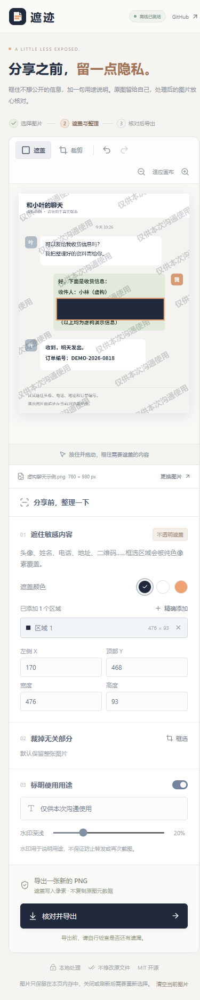

# v0.1.0 验证记录

日期：2026-09-26。环境：Windows、Node.js 20.19.6、Chromium 自动化浏览器。所有图片均为程序生成的虚构样例，不含真实个人资料。

## 自动检查

`npm ci` 安装成功，安装时审计报告为 0 个已知漏洞。`npm run check` 通过：38 项图像核心测试、TypeScript 检查、Vite 正式构建。安装审计不是独立安全审计。

测试涉及 PNG/JPEG 字节识别、损坏文件、PNG 校验和、动画 PNG 拒绝、文件/尺寸限制、反向选区与边界、透明颜色拒绝、裁剪和水印参数、PNG 非必要区块清理，以及导出错误时的资源释放。详见 [image.test.ts](../src/lib/image.test.ts)。

## 实际浏览器与文件检查

| 检查             | 结果                                                                                                                                          |
| ---------------- | --------------------------------------------------------------------------------------------------------------------------------------------- |
| 桌面工作台       | 1440 × 1120 视口，选图、反向拖动遮盖、用途水印、最终预览与下载通过                                                                            |
| 手机布局         | 390 × 844 视口，无页面水平溢出；工具栏窄屏换行；截图见下方。此项是浏览器视口模拟，不是手机真机测试                                            |
| 精确选区         | 200 × 120 输入中，使用界面设置 x=20、y=10、宽=80、高=50 后下载 PNG                                                                            |
| 真实遮盖像素     | 使用 Pillow 检查上述导出的全部 4,000 个选区像素，均为 `(32,42,60,255)`；选区外已知像素保持原值                                                |
| 透明背景         | 输入 `(0,0)` 为透明像素，输出为不透明白色 `(255,255,255,255)`                                                                                 |
| 元数据           | 输入 PNG 带有 tEXt 测试私密标记；导出仅含 IHDR、IDAT、IEND，测试标记消失；磁盘原始文件仍保留该标记                                            |
| 裁剪与水印       | 反向拖出原图坐标 `(20,19,170,93)` 的裁剪区域，启用水印；下载文件尺寸为 170 × 93，每个像素与工作画布对应裁剪区域一致；遮盖区仍是完全不透明实色 |
| EXIF 朝向        | 160 × 80、Orientation=6 的左右红蓝 JPEG，解码为 80 × 160，上红下蓝，画布像素核对通过                                                          |
| 损坏图片         | 上传无效 PNG 会显示错误，并保留之前可用图片                                                                                                   |
| 编辑历史与空坐标 | 撤销后区域数从 1 变 0，重做恢复为 1；清空坐标后失焦会恢复旧值，不会被解释成 0                                                                 |
| 真实离线         | 正式版显示离线就绪后停止本地静态服务器，独立 HTTP 请求确认连接失败；重新打开应用、重新选图、添加遮盖、生成预览并下载 PNG 均通过               |
| 临时存储         | 重新打开应用显示空白工作台；图片不会作为编辑项目跨刷新保存                                                                                    |
| 运行时资源       | 初次加载资源列表仅见同源 JS、CSS、manifest 和图标；处理流程在服务器关闭后仍完成；浏览器未报告未捕获错误                                       |

## 已修复的问题

- 导出期间锁定编辑，下载完成状态绑定导出时的编辑版本。
- 坐标输入为空时恢复原值；预览失败时清空画布并禁用导出。
- 1 像素小图的精确添加区域不会超过图片边界。
- 水印初始值与滑块步长一致；窄屏工具文字保持完整。
- PNG 导出后释放临时画布；离线缓存匹配兼容静态服务器的 `Vary: Origin`。

## 未覆盖与后续验证

尚未验证 Safari、Firefox、iOS/Android 真机、低内存设备下接近上限的大图、全部相机 JPEG 变体及完整辅助技术体验。未做独立安全审计，也不提供自动隐私识别。

首批试用建议找 5 位经常分享物流、客服或报错截图的人，各完成一次“遮住指定信息并导出”的虚构任务，记录完成时间、坐标/下载误操作和最终漏选情况。是否减少操作负担、是否值得持续使用，需要真实反馈，不以功能完成或测试通过代替需求验证。

